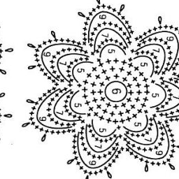
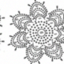
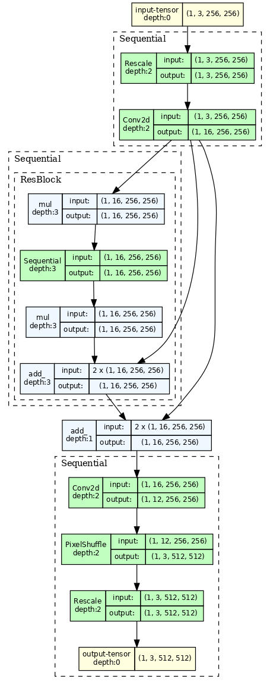
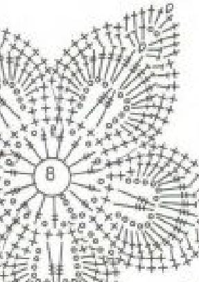
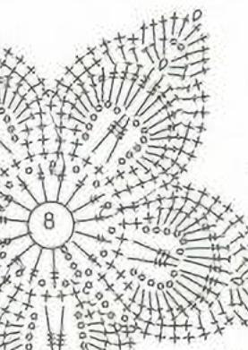
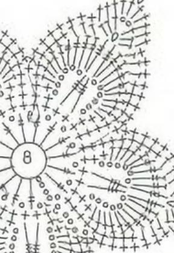

Attempt to finetune an [existing x2 super-resolution model](https://github.com/Coloquinte/torchSR/blob/main/doc/NinaSR.md) defined in [torchSR-python](https://github.com/Coloquinte/torchSR) to make it work with schematic diagrams instead of photos.

# (V1) Initial model implementation

Disclaimer: images are not mine, all credits to authors, please, contact in case of wanting to take down. All of the code is done only in scope of required universty project and not done for commercial use.

### Data collection
Considering the scope of the project, the data required is rather specific, while still being high resolution, which is why collection of data will be done manually. Considering that it is a university project, we won't focus on copyright and just collect data.

Most of the schemes exist as pieces of journals, which means that actual data we need is only a piece of an image, so it will take a lot of time to extract manually in image editor.

In order to improve collection speed a [custom browser script] was made that allowed fast selection of rectangular region of any image, that allowed to quickly collect the dataset without manual extraction of schemes.

## Data selection preparation
Images, used for the training were 80-20 split into training and validation sets with additional augmentation: each training instance is a pair of high and low resolution pair (hr, lr).
- For each existing image generate 15 cropped instances with random dimensions with at least 256px size.
- Apply a random rotation (50% orthogonal rotation, 50% small ${ \pm 30 }$ degrees).
- Generate LR image with Bicubic smoothing that is x2 smaller.
- Add additioan blur and noise.

Example of high-resolition image, expected output.

Example of low-resolition image with noise & blur applied, model input.

## Model Selection
The main problem is resource constraints i.e. out of compute resources only a single AMD Ryzen laptop is available integrated AMD GPU without CUDA support, so in any case the training will be done only with CPU, so anything bigger than 1 million parameters will last forever.

After experimenting the different approaches and mainly looking for smallest and good enough existing model to fine tune, found [TorchSR](https://github.com/Coloquinte/torchSR/tree/main/torchsr) repository, which included **NinaSR B0 x2** upscale pytorch model that provided good enough performance.

Compared to other variants, this model already has pretrained weights, while still having 0.1M parameters, which the computer can handle.

### Original model
NinaSR is a neural network to perform super-resolution.

Structure overview, note that in reality there are 10 ResBlocks.

Simple residual block (two 3x3 convolutions) with a channel attention block were used - only simple convolutions. After some experiments, the residual block has an expansion ratio of 2x (similar to WDSR), and the attention block is local (31x31 average pooling) instead of global.

Deep and narrow networks tend to have better quality, as exemplified by RCAN. This comes at the cost of a slower training and inference. I picked parameters that achieve high quality while keeping near-optimal running times on my machine.

The network is initialized following ideas from NFNet: the layers are scaled to maintain the variance in the residual block, and the second layer of each block is initialized to zero.

## Training process
Using standard L1 loss function both for validation values and training. No cross-validation was used, all training is done using a single training and single validation set.

Training is done using batching with 4 instances per step, 100 epochs max, each epoch took around 10 minutes to train. Training data selection is using additional augmentation with smoothing and cropping to avoid limiting on the existing data set.

After around 10 hours and 80 epochs, validation loss have stopped at `0.045`, while initially being `0.1`.

## V1 results

Original image (Source: Journal Duplet)

x2 Upscaled with original model

x2 Upscaled with finetuned model v1 (80 epoch runs)

The results now seem more clear now, compared to the orignal model, which marks a first improvement i.e. denoising, but still the model didn't receive much modifications regarding the transofrmation or explicit training for text and line completion, which results in having more and more thin lines and skew after applying the upscale multiple times.

# (V2) Transforming the model from smoothing to edge intensification
Compared to standard super reoslution models, which have main goal of generating a context-relevant texture + smoothing, our use case is mainly edge and object detection, improving and completing the diagrams, which implies improving and keeping edges and lines + avoiding smoothing in case of ambiguity.

# References and literature:
- https://github.com/Coloquinte/torchSR/tree/main
- CS360 Course and tasks
- **CS375 Course and tasks** - notes on CNN specifically
- CS420 Course and tasks
